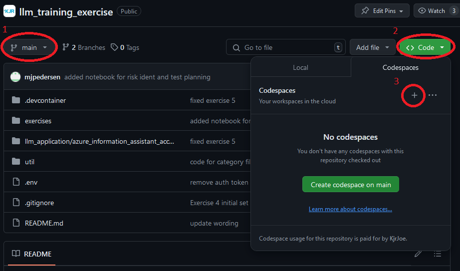
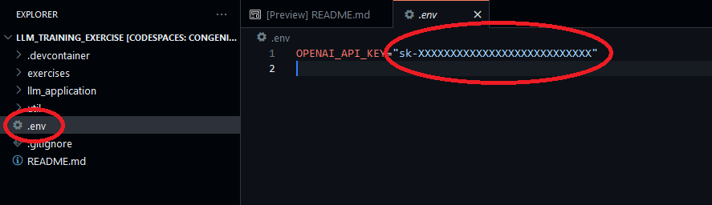
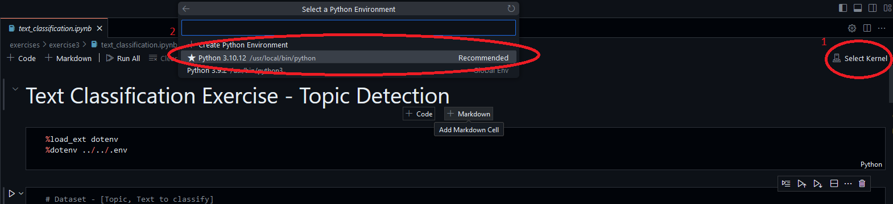
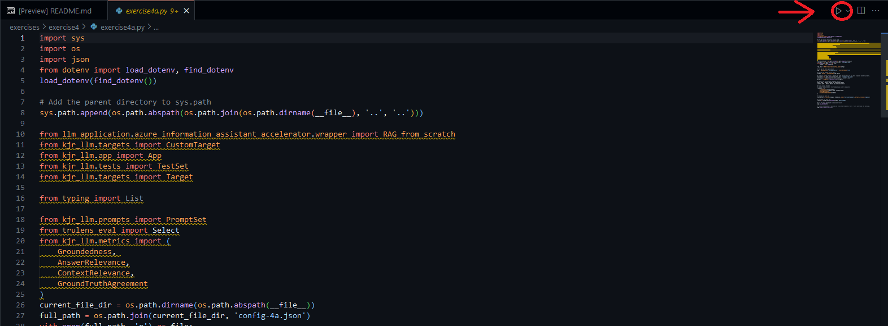

# KJR LLM Testing Exercises
This repository contains exercises to supplement the material delivered in KJR's LLM-testing training course. 

## Instructions
The exercises are intended to be completed in a `Github Codespace`, a vscode-based containerised development environment which can be accessed from a browser and will enable you to run the required code examples. 

The environment will come preinstalled with relevant `vscode extensions`, a compatible version of the `Python` programming language and suite of `Python packages` required to run the exercises.  

### Creating a Codespace

1. Ensure that you are on the `main` branch, click the `Code` button, then the `Codespaces` tab and finally press the `+` to launch a new codespace. 

2. The codespace will automatically open in a new tab in your browser and take a few minutes to build.

3. Navigate to https://platform.openai.com/api-keys and create a new Open AI API key, it should look something like `sk-XXXXXXXXXXXXXXXXXXXXXXXX`

4. Open the `.env` file and paste the key you just created into the quote marks next to `OPENAI_API_KEY`, once done the file should look like this:
```
OPENAI_API_KEY="sk-XXXXXXXXXXXXXXXXXXXXXXXX" 
```


### Running Exercises
Exercises are delivered as a combination of `Jupyter Notebooks` and `Python scripts`, the following sections contain instructions on how to run each of them.
#### Jupyter Notebooks
Some exercises are delivered through `Jupyter Notebooks`. `Jupyter Notebooks` are interactive computing environments that allow users to create and share documents containing live code, equations, visualizations, and narrative text. They are widely used for data analysis, scientific research, and machine learning due to their versatility and ease of use. Jupyter Notebooks enable code to be divided into cells which can be run individually, outputs will be displayed beneath the cell.

Before running a Jupyter Notebook, a kernel must be selected. This can be achieved by following these instructions

1. Click `Select Kernel` in the top-right corner.
2. A drop-down menu will appear in the center of the screen, click `Python environments...`
3. Select `Python 3.10.12`


#### Python Scripts
Some exercises are delivered as `Python scripts`. Follow these instructions to run a Python script

1. Use the terminal to navigate to the directory containing the exercise

```
cd exercises/exercise4
```

2. Run the exercise script with Python

```
python exercise4a.py
```

OR

1. Open the relevant script in the editor

2. Click the triangle-shaped *play* button in the top-right corner

